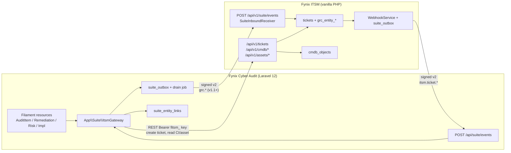
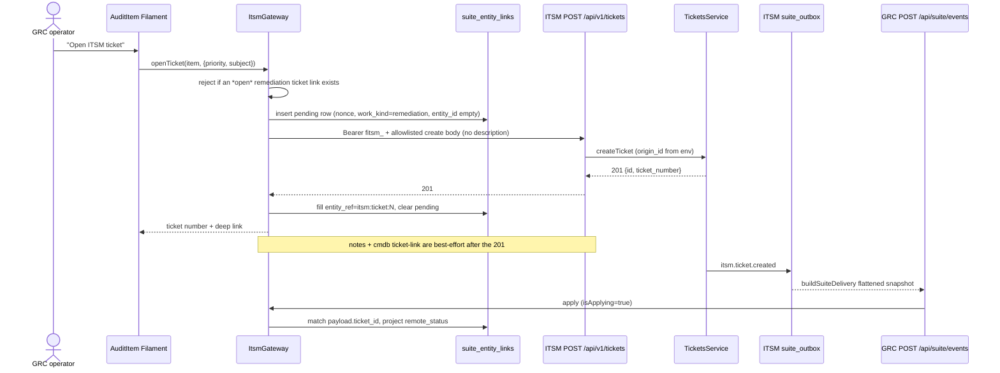
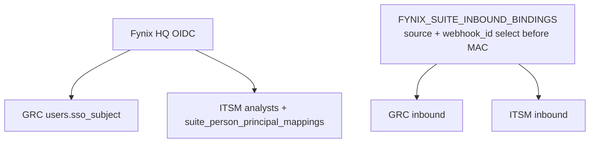

# Fynix Cyber Audit (GRC) ↔ Fynix ITSM Integration

| Field | Value |
|---|---|
| **Author** | TBD |
| **Date** | 2026-08-13 |
| **Status** | Draft |
| **Audience** | Senior engineers on Cyber Audit and ITSM |
| **Repos** | `fynixCyberAudit`, `ITSM/fynixitsm` |
| **Constraint** | Small-sized datacentre. No ITOM. Permanently. |

---

## Overview

Fynix Cyber Audit is the GRC control room: Standard → Control → Implementation → Audit → Data Requests / IRL → Risk, plus Policies, local Asset/Application notes, Vendor TPRM, Trust Center, and optional enterprise flags (AI audit, Surveyor, Risk Assessor, POA&M remediation, SANS cyber IR). It is explicitly **not** an enterprise GRC suite — `CONTEXT.md` forbids a rule engine and a ServiceNow-scale CMDB, and `PRD.md` §7 forbids replacing Fynix PPM, ITSM, Finance, or HR.

Fynix ITSM is the operational floor: tickets + SLA/OLA, catalog, major incidents (outages), problems, change/CAB, CMDB, assets (Intune/vCenter/agent/Zabbix/Wazuh), suppliers/contracts, knowledge, LMS, workflow, automation, REST, HMAC webhooks, and a durable suite outbox. `ROADMAP-servicenow-parity.md` lists GRC as out of scope. That decision stands: GRC stays in Cyber Audit; ITSM stays the operational system of record.

This design wires them the way the rest of the suite is already wired — **events as the signal path, REST as the command path, domain ownership as the law**. For a small datacentre (~20–80 CIs, a handful of GRC operators, tens-to-low-hundreds of tickets per month) the high-leverage seams are: one HQ identity with fail-closed bindings, CI-as-entity links, failed-audit / overdue-POA&M work becoming ITSM tickets, and deep links both ways.

No ITOM. No discovery platform. No IntegrationHub. No CCM engine. No merging of SANS cyber-IR incidents with ITSM major incidents. Inventory already lives in ITSM; GRC must not grow a second one.

---

## Background & Motivation

### Current state

**GRC today** (`/Users/rindahluanga/projects/fynixCyberAudit`):

- Laravel 12 / Filament 4 / Livewire 3. REST under `/api` (Sanctum). MCP at `POST /mcp/fynixcyberaudit`.
- Staff identity is Fynix HQ OIDC via `app/Identity/IdentityService.php` (authorization-code, CSRF state, iss/aud/sub, `email_verified` fail-closed, **sub-first** linking). A miss on `sso_subject` still matches an existing `is_sso` user by email; a local-password account with the same email is **refused** (`IdentityException::localAccountExists`). Never adopt a local password user by email, and never derive a suite person UUID from email.
- Files go through `app/Access/FileAccess.php`. `Model::unguard()` is gone. Writes are `$fillable`.
- Enterprise modules are flags in `config/enterprise.php` / `App\Support\Enterprise`: `ai_audit`, `surveyor`, `risk_assessor`, `remediation`, `incidents`.
- **No suite inbound receiver. No CMDB client. No ticket writer.** A grep of the GRC tree for suite/ITSM integration returns nothing but product prose.
- Local `Asset` (`app/Models/Asset.php`) and `Application` (`app/Models/Application.php`) are GRC-side inventories with taxonomy, finance, and warranty fields. They attach to implementations and risks. They are **not** ITSM CIs.
- Failed-control work already has a GRC-native home: `App\Remediation\Remediation::createTaskFromAuditItem()` writes a `remediation_tasks` row (`audit_item_id`, weakness from `auditor_notes`) when `MODULE_REMEDIATION_ENABLED` is on. That row is a POA&M plan, not a service-desk ticket.
- Cyber IR is `App\Incidents\IncidentDesk` — SANS 6-phase, `INC-YYYY-####`, `involves_pii` / `is_breach` flags. Completely separate from ITSM MIM.

**ITSM today** (`/Users/rindahluanga/projects/ITSM/fynixitsm`):

- Vanilla PHP MPA. REST at `/api/v1/` (`fitsm_…` hashed keys, company-scoped).
- Suite inbound: `POST /api/v1/suite/events` (`api/v1/resources/suite.php` → `SuiteInboundReceiver`). Signed v2 envelope. Bindings in `FYNIX_SUITE_INBOUND_BINDINGS`. Fail-closed startup preflight (`SuiteInboundConfig::assertStartupConfiguration`). Currently accepts **HR person-lifecycle events only**. After a valid MAC, anything that is not `hr.person.*` with `entity_type === 'person'` returns **`invalid_event` 400** (`validatePersonLifecycle()`). That is **not** the contract’s unknown-event no-op; GRC must not assume it, and ITSM must gain an explicit no-op branch before any `grc.*` emit (PR 2a).
- Suite outbound: `WebhookService::SUITE_EVENT_MAP` already maps `ticket_created|updated|resolved|assigned` **and** `lms_course_completed` → `itsm.lms.course_completed` (emitted today from `includes/services/lms_webhooks.php`). `reporting_executive_snapshot` and `wiki_assurance_snapshot` are the still-planned ones. Durable outbox `suite_outbox` drained by `cron/suite_outbox_drain.php`. Ticket suite bodies are built by `WebhookService::buildSuiteDelivery()` — flattened snapshot, UUID v5 `entity_id`, **not** a nested `{ticket, grc}` object (see Envelope).
- PPM is a **second** integration, not a third protocol: same HMAC envelope, dedicated receiver `POST /api/ppm/webhook.php`, REST client `includes/ppm/PpmClient.php`, write-back suppressed by `PpmSync::isApplying()`.
- CMDB is analyst-maintained typed objects (`cmdb_objects`, `cmdb_classes`, `ticket_cmdb_objects`). REST: `GET/POST /api/v1/cmdb/objects`, `GET /api/v1/cmdb/classes`.
- Asset discovery (Intune, vCenter, Windows agent, Zabbix/SolarWinds/Wazuh) is already ITSM-owned (`docs/asset-discovery.md`). That stays.

### Pain

A small DC running both products currently has:

1. Two inventories (GRC `assets` / `applications` vs ITSM `cmdb_objects` / `assets` / `software`).
2. Failed audit items that become GRC POA&M tasks nobody on the service desk sees.
3. No way to open the CI or ticket the control actually sits on.
4. Change L×I and recurring problems that never reach the GRC risk register (and must not silently write it).
5. One HQ identity already, but no suite customer/company binding between the two apps.

### Why now

The suite already has the wiring: v2 envelope, bindings, outbox, HR inbound, PPM command/event split, `entity-link.schema.json`. GRC is the missing subscriber/publisher. Building this for a small DC is a handful of links and one work-handoff, not a CCM platform.

---

## Goals & Non-Goals

### Goals (v1 — small DC, high leverage)

1. **Identity / tenant binding.** One HQ identity. Suite customer ↔ ITSM company binding. Fail-closed config copied from HR inbound. No email-derived identity linking.
2. **CI as entity.** GRC implementations, controls, risks, and (optionally) local Asset/Application notes can store a link `itsm:cmdb:<id>` and/or `itsm:asset:<id>`. ITSM remains inventory SoR. GRC does not dual-write CIs or assets.
3. **Failed audit item / overdue POA&M task → ITSM ticket.** Operator action creates a ticket via ITSM REST, stores the foreign ref on the GRC row, receives status write-back via existing `itsm.ticket.*` events.
4. **Deep links both ways.** Open the CI/ticket in ITSM from GRC. Open the audit item / risk / POA&M / IR record in GRC from ITSM.

### Goals (v1.1 — still no ITOM)

5. Change approved / emergency / failed PIR as a **signal** on linked GRC objects (retest flag + note). Never auto-mutate residual scores.
6. Recurring / known-error problem **proposes** a GRC risk. A human promotes it. Never silent create.
7. Vendor = supplier join on a shared suite vendor id. Two facets, one org.
8. Optional link between ITSM MIM (availability) and GRC Incident (cyber/breach) when PII/breach flags are set. Two records.

### Goals (later)

9. LMS course completion (`itsm.lms.course_completed`, already in the catalog) as policy-acknowledgement evidence.
10. A handful of scheduled workflow rules calling a GRC “record test result” API (CCM-lite). Only if it stays a few rules, not a discovery platform.

### Non-goals (permanent for this design)

- ITOM, Discovery-as-a-platform, Event Management, Service Mapping, MID servers.
- Auto-building a CMDB from network sweeps. Existing ITSM discovery stays ITSM-owned.
- IntegrationHub-scale connector libraries.
- Enterprise risk roll-up across hundreds of business units.
- Security-ratings vendor feeds (BitSight et al.).
- BCM.
- Turning GRC into a second service desk (no GRC ticket inbox, no SLA engine in GRC).
- Merging GRC SANS cyber-IR incidents with ITSM major incidents.
- Multi-MSP GRC tenancy. Bindings must not need a rewrite for a second company; do not build MSP GRC.
- Hosting GRC as multi-tenant SaaS (upstream license).
- Vendor portal (`/portal`) and Trust Center (`/trust`) on this path. They stay off HQ OIDC (`CONTEXT.md`).

---

## Scale assumptions

| Dimension | Assumption |
|---|---|
| Companies / tenants | 1 company, 1 ITSM tenant. Bindings keyed so a second company is config, not a rewrite. |
| CMDB | ~20–80 CIs. Classes: rack, server, VM, network gear, application, service. Analyst-maintained. |
| Assets | ~50–200 ITSM assets (custody/discovery). |
| Applications | ~5–15. |
| People | ~2–8 GRC operators. ~5–20 ITSM analysts. |
| Frameworks | ~1–3 (e.g. TSC 2017 + a NIST subset). |
| Ticket volume | Small-DC helpdesk: tens to low hundreds / month. Not thousands / day. |
| Integration traffic | Low. Event bus, not a mesh. Peak: a few events per ticket write + one REST create per remediation. |
| Create-ticket latency | Operator-interactive. **p95 < 2 s** end-to-end. |
| Webhook apply | Async is fine. p95 < 30 s after `suite_outbox` drain. |
| Storage | `suite_entity_links` hundreds of rows. Outbox / inbound audit tens–hundreds / month. Negligible. |
| Body / freshness | Suite contract: 64 KiB max, 6 h clock skew (`suite-contracts/limits.json`). |

If these numbers are wrong by 10× the design still holds. If they are wrong by 100× (MSP, ITOM, hundreds of BUs), this is the wrong product.

---

## Proposed Design

### Architecture

Two deep modules, one seam each. If you deleted `App\Suite\ItsmGateway` from GRC, HMAC / bindings / outbox / retries / CI search would reappear across Filament resources — that is the test that the module earned its keep.



### Protocol choice (locked)

| Path | Mechanism | Why |
|---|---|---|
| **Signals** (status, assignment, resolved, later change/problem/MIM) | Suite v2 envelope → existing `POST /api/v1/suite/events` (ITSM) and new `POST /api/suite/events` (GRC) | One protocol. Same HMAC, headers, outcomes, vectors as HR. Do **not** add a third `POST /api/grc/webhook.php`. ITSM inbound today 400s non-person events after a valid MAC; PR 2a adds the contract no-op **before** GRC emits anything. GRC inbound implements signed-unknown → 200 `ignored` in the kernel (PR 3b), it does not copy `SuiteInboundReceiver`. |
| **Commands** (create ticket, search/read CI, read asset, attach note) | ITSM REST `/api/v1/…` with a dedicated `fitsm_` key | Operator-interactive create must be < 2 s. HR JML and `POST /api/suite/workflow-activities/execute.php` are queued — too slow for a Filament action (see Alternative 6). PPM already uses this split (`PpmClient` REST + signed webhooks). |

PPM’s receiver is **not** the template to copy for a new product. PPM predates the shared inbound endpoint; new products join `suite/events`. PPM is the template for **command vs signal** and for `isApplying()` loop suppression.

### Domain ownership (confirmed against code)

| Domain | System of record | Evidence |
|---|---|---|
| Standards, controls, implementations, audits, audit items, data requests, IRL, GRC risk register, policies, vendor TPRM surveys, Trust Center, POA&M (`RemediationProject` / `RemediationTask`), SANS cyber IR (`Incident`) | **GRC** | Models under `app/Models/`. PRD §4. `docs/plans/enterprise-features.md` (POA&M is not PPM). |
| Tickets, changes, problems, major incidents (outages), CMDB CIs, asset custody/discovery, suppliers/contracts, workflow, SLAs, catalog, LMS completions | **ITSM** | `PRODUCT.md`. `TicketsService`, `CmdbService`, `ChangesService`, `ProblemsService`, `MimService`. |
| CI as “entity” for a control / implementation / risk | **ITSM CMDB id**, stored as a **link** on the GRC row | `cmdb_objects.id` is the immutable key (`docs/cmdb.md`). GRC `Asset` / `Application` stay local notes. |
| Failed-control / overdue-POA&M **work** | **ITSM ticket** (or change in v1.1). GRC keeps the plan row + foreign ref | Mirrors PPM work-package ↔ ticket, inverted. |
| Change L×I | Stays on the change (`changes.risk_likelihood` × `risk_impact_score`) | May *signal* GRC. Never write `Risk.residual_*`. |
| Recurring problem | Stays a problem (`problems.is_known_error`) | May *propose* a GRC `Risk`. Never silent-create. |
| MIM vs GRC Incident | Two records | MIM is a declaration on a ticket (`08-major-incidents.md`). GRC IR is SANS 6-phase (`IncidentDesk`). Optional link only. |
| Vendor / supplier | One org, two facets | GRC `vendors` (surveys, rating). ITSM `suppliers` (contracts, legal name). Join on `suite_vendor_id`. |
| Policy attestation | GRC `Policy` is SoR | ITSM LMS completion is **evidence**, v1.2. |
| CCM / indicators | **Out of v1** | Small DC: humans + data requests are enough. |

**Neither side overwrites fields it does not own.** Same sentence as ITSM `PRODUCT.md` principle 5 and the PPM runbook §1.

### Module shape

#### GRC: `App\Suite\` (one deep module)

```
app/Suite/
  ItsmGateway.php              # the only type Filament / jobs / MCP talk to
  SuiteConfig.php              # fail-closed bindings, URLs, key, tenant UUID
  SuiteEnvelope.php            # sign + verify fynix-v2 (NUL separators)
  SuiteInboundController.php   # POST /api/suite/events
  SuiteInboundReceiver.php     # HMAC, binding select, idempotency, high-water
  SuiteOutbox.php              # Eloquent model + drain command
  EntityLink.php               # Eloquent for suite_entity_links
  EntityRef.php                # value object itsm:cmdb:12 / itsm:ticket:441
  Contracts/
    ItsmClient.php             # interface
  Http/
    LiveItsmClient.php         # Guzzle, TLS required
  Testing/
    FakeItsmClient.php         # in-memory; tests never hit ITSM
  Apply/
    ApplyTicketEvent.php       # itsm.ticket.* → link status projection
    ApplyChangeSignal.php      # v1.1
    ApplyProblemProposal.php   # v1.1
    ApplyLmsCompletion.php     # later
  Support/
    DeepLink.php               # URL builders
    WriteGuard.php             # isApplying() equivalent
```

Public surface of `ItsmGateway` (keep this small):

```php
interface ItsmGateway
{
    public function enabled(): bool;

    /** Search CIs. Never caches writes; short TTL cache of class list is OK. */
    public function searchConfigurationItems(string $query, ?string $classKey = null, int $limit = 20): CiPage;

    public function getConfigurationItem(int $id): ?CiSummary;
    public function getAsset(int $id): ?AssetSummary;

    public function link(Model $local, EntityRef $remote, string $relation = 'reference'): EntityLink;
    public function unlink(EntityLink $link): void;
    public function linksFor(Model $local): Collection;

    /**
     * Operator-interactive. Persist a pending local link, then POST /api/v1/tickets.
     * p95 < 2s for the create + local commit. Notes and CI attach are best-effort.
     * At most one *open* remediation ticket per source row; a new ticket is
     * allowed only after remote_closed_at is set (see Open-ticket rule).
     */
    public function openTicket(Model $source, OpenTicketRequest $request): OpenTicketResult;

    public function ticketStatus(EntityLink $ticketLink): ?TicketStatusProjection;

    public function itsmUrl(EntityRef $ref): string;
    public function grcUrl(Model $local): string;
}
```

Filament resources call **only** this. They do not construct HMAC strings, they do not know `fitsm_`, they do not parse `X-Fynix-*`.

#### ITSM: extend the existing suite module (do not fork)

| Piece | Action |
|---|---|
| `includes/suite/SuiteInboundReceiver.php` | **PR 2a (v1, before any GRC emit):** after MAC + binding + envelope parse, event types outside the person catalog return **200 `ignored`** and do not call `validatePersonLifecycle()`. Today they 400 `invalid_event`. Adding `grc.*` to `SUPPORTED_EVENT_TYPES` alone is insufficient — that helper still demands `entity_type === 'person'`. |
| `api/v1/resources/tickets.php` + `TicketsService` | Accept optional `grc_entity_type` / `grc_entity_id` / `grc_entity_url` on **create only**. Persist on `tickets`. Never add them to `updateTicket()`’s allowlist. Include the same three fields on the **ticket snapshot** `emitWebhook` already wraps as `['ticket' => $snapshot]`, so `buildSuiteDelivery()` flattens them onto `payload` (optional apply fallback). Inbox card + “Clear GRC link” control. |
| `includes/services/webhooks.php` | No new ticket event types for v1. `buildSuiteDelivery()` already flattens the snapshot; do not invent a nested `{ticket, grc}` wrapper. v1.1 appends `itsm.change.*` / `itsm.problem.*` / `itsm.mim.*` to `SUITE_EVENT_MAP` **and** `suite-contracts/event-catalog/itsm.json` (map ⊆ catalog guard). |
| Ticket inbox | When `grc_entity_id` is set, render an “Open in Cyber Audit” card and a “Clear GRC link” action (analyst-only). |
| CMDB object page | v1: no GRC panel required (link lives on the GRC row). v1.1: optional reverse card after GRC emits `grc.entity.linked` (PR 9a) **and** ITSM no-op/apply can accept it (PR 2a). |
| New file `includes/grc/GrcRefs.php` | URL builder + “do not overwrite owned fields” helpers. Small on purpose. |

### Sequence: open a ticket from a failed audit item



Write-back of later `itsm.ticket.updated|resolved|assigned` updates **only** the projection columns on `suite_entity_links`:

| Column | Source on the flattened snapshot | Not a source |
|---|---|---|
| `remote_status` | `open` \| `closed` from `payload.status_is_closed` (bool). Optional `remote_status_id` = `payload.status_id`. | `status.name`, `status_id` as a display string |
| `remote_assignee` | `payload.assigned_analyst_id` as a string (ITSM analyst id). Null if unassigned. | `actor_id`, `created_by`, display name |
| `remote_closed_at` | `now()` when `status_is_closed` becomes true; NULL if it flips back to open | — |

Apply matches **`payload.ticket_id` (int)** to `suite_entity_links.entity_id` / `itsm:ticket:{id}` stored from the REST 201. Envelope `entity_id` is an opaque suite UUID (`WebhookService::suiteTicketId`); do not parse it as the numeric ticket id. Display names (status label, analyst name) are **not** on the event. Resolve them lazily via `GET /api/v1/tickets/{id}` (`tickets.read` is on the key; `analysts.read` is not) when the chip or Admin refresh is shown.

It does **not** change `AuditItem.effectiveness`, `AuditItem.status`, `Risk.residual_*`, or `RemediationTask.status`. Closing the ticket may *suggest* the operator mark the POA&M complete; it never does it.

**`actor_id` / `created_by` are not “who just changed the ticket.”** `buildSuiteDelivery()` sets `actor_id = "itsm:" . created_by`, but `created_by` on the snapshot is:

| Event | Snapshot builder | `created_by` / `actor_id` |
|---|---|---|
| `itsm.ticket.created` | `createTicket()` sets `created_by = $ctx->actorId` | The `fitsm_` **analyst** (`itsm:{FYNIX_ITSM_SYNC_ANALYST_ID}`) |
| `itsm.ticket.updated\|resolved\|assigned` | `findTicketEventRow()` selects **`t.user_id AS created_by`** (`tickets_repo.php`) | The **portal requester** (`itsm:{users.id}`), not the analyst who assigned or resolved |

Apply **never** treats `payload.created_by` or `actor_id` as the acting analyst. Loop-ignore on `itsm:{FYNIX_ITSM_SYNC_ANALYST_ID}` would only drop the **create** echo and, on a fresh DC where `analysts.id` and `users.id` both start at 1, would drop every later write-back for that requester. **Do not ignore on `actor_id`.** v1 never PATCHes tickets, so there is no echo loop to suppress. `WriteGuard::isApplying()` still exists so v1.1 `grc.*` emits do not fire while applying inbound.

Canonicalize `occurred_at` to `Y-m-d\TH:i:s+00:00` **before** high-water `strcmp`. Shipping ITSM uses `Z`; `envelope-v2.schema.json` and `SuiteInboundReceiver::canonicalOccurredAt()` require `+00:00`. Storing mixed forms would invert order.

#### Open-ticket rule (v1, one behaviour)

| Situation | Behaviour |
|---|---|
| No `work_kind=remediation` ticket link | Operator action creates one ticket. |
| A link exists with `remote_closed_at IS NULL` **and** `remote_status = 'open'` (from `payload.status_is_closed === false`; unknown/`null` counts as open) | **No-op.** Return the existing ticket number + URL. Do not POST `/tickets`. |
| Every existing remediation ticket link has `remote_status = 'closed'` **or** `remote_closed_at` set | Operator action may open a **new** ticket (new link row). Distinct `entity_ref` values satisfy `UNIQUE (local_type, local_id, entity_ref, relation)`. |
| A `pending` link exists (nonce written, no `entity_id` yet) | **Retry, do not create.** `GET /api/v1/tickets?…` by `grc_entity_type` + `grc_entity_id` if the previous 201 was lost; otherwise re-POST only after the pending row is older than 2 minutes **and** no matching ITSM ticket is found. |

“Idempotent on `(local_type, local_id, work_kind)`” applies only to the **in-flight** create (the pending nonce), not to the lifetime of the GRC row. The schema allows many tickets per row; the **open** cardinality is one.

Closed-set computation: **`payload.status_is_closed` only** (the snapshot has no `status.name`). Until the first event arrives, treat a just-created ticket as `remote_status = open`. A periodic `GET /api/v1/tickets/{id}` reconciliation (daily, or on the Admin page “Refresh”) heals a missed webhook and fills display names.

#### Create-path failure modes

`openTicket` is **one** required REST call (`POST /api/v1/tickets`) plus two optional ones. ITSM ticket create has **no** `idempotency_key` (unlike `POST /api/suite/workflow-activities/execute.php`).

1. **Before REST:** insert a `pending` `suite_entity_links` row with a random nonce in `entity_ref` (`pending:{ulid}`) and `work_kind=remediation`. If this insert hits the open-ticket rule, stop.
2. **POST `/tickets`.** On 201, update the pending row to `itsm:ticket:{id}`, store `remote_url`, return success to the operator. p95 budget is this hop + the local commit. Numeric `FYNIX_ITSM_ORIGIN_ID` / `TICKET_TYPE_ID` / `DEPARTMENT_ID` / `COMPANY_ID` are env ints so create does **not** also `GET /origins` on the hot path.
3. **Crash after 201, before the link update:** next click sees the pending row → `GET /api/v1/tickets` filtered by `grc_entity_type` + `grc_entity_id` (ITSM list already supports id filters; add `grc_entity_type` / `grc_entity_id` query params in PR 2) → adopt the existing ticket. If none, and the pending row is stale (> 2 min), allow one more POST.
4. **Notes (`POST /tickets/{id}/notes`) and CI attach (`POST /cmdb/objects/{id}/tickets`):** best-effort **after** the operator already has the ticket number. Failure shows a warning on the Filament notification (“Ticket TCK-1042 created; could not attach the internal note / CI”). Do not fail or roll back the action. A “Retry attachments” link on the chip re-runs only those two calls.
5. **Never send `description`.** `TicketsService::createTicket()` writes `$description` as the **public initial email** (`insertInitialEmail`). Auditor notes go only in the later internal note (`is_internal` defaults true in `apiTicketNotesCreate`).

This keeps p95 honest on a WAN path: one create POST, not three serial required hops.

### What “failed” means (code, not PRD prose)

`PRD.md` §4.2 describes audit items as Not Assessed / Compliant / Partially Compliant / Non-Compliant / Not Applicable. The **shipped** model is three enums on `audit_items`:

| Column | Enum | Values |
|---|---|---|
| `status` | `App\Enums\WorkflowStatus` | Not Started, In Progress, Completed, Unknown |
| `effectiveness` | `App\Enums\Effectiveness` | Effective, Partially Effective, Not Effective, Not Assessed |
| `applicability` | `App\Enums\Applicability` | Applicable, Not Applicable, Partially Applicable, Unknown |

**v1 eligibility (default):**

```
effectiveness IN (Not Effective, Partially Effective)
AND applicability <> Not Applicable
AND no existing *open* itsm:ticket link of work_kind = remediation
    (remote_status = 'open' OR (remote_status IS NULL AND remote_closed_at IS NULL))
```

The action is **operator-initiated**. Do not auto-open a ticket on every save. A small DC will otherwise flood the helpdesk during an audit week. After the ticket is closed, the operator may open a **new** ticket (see Open-ticket rule).

**Overdue POA&M (when `MODULE_REMEDIATION_ENABLED`):**

```
remediation_tasks.due_date < today
AND status NOT IN (Completed, Cancelled, Risk Accepted)
AND no existing *open* itsm:ticket link
```

Same action, same ticket shape. Prefill subject from `RemediationTask.number + title`. Weakness text (`weakness_description`) goes in the **internal** note, never in `description`.

**POA&M operator surface (net-new in PR 5).** `RemediationProjectResource` today is list + empty `ViewRemediationProject` (stock `ViewRecord`). There is no board, no task relation manager, no per-task page. `Remediation::createTaskFromAuditItem()` and the status set in `docs/plans/enterprise-features.md` §6 exist; the click target does not. v1 does **not** wait for the enterprise board:

- Primary: “Open ITSM ticket” on `AuditItemRelationManager` (the real operator path — `AuditItemResource` has `$shouldRegisterNavigation = false`).
- Also: the same action on `AuditItemResource` view/edit for deep links.
- POA&M: a **compact task table** added to `ViewRemediationProject` in PR 5 (code, title, status, due, existing ticket chip, action). That table is in scope for PR 5. The kanban/board from enterprise-features.md is **not**.

### Ticket payload (ITSM-owned fields GRC may set at create)

`apiTicketsCreate` already requires `subject` and `requester_email` (`api/v1/resources/tickets.php`). **Create-body allowlist** — `LiveItsmClient` sends **only** these keys. Anything else (including `description`) is a client bug.

| Field | Source | Notes |
|---|---|---|
| `subject` | `[GRC] {Audit.title} / {auditable title}` or `[POA&M] {task.number} {task.title}` | Short label. No auditor notes. |
| `requester_email` | `FYNIX_GRC_REQUESTER_EMAIL` | Non-human. **Never** the operator’s email. `TicketsService::createTicket()` **auto-creates** a portal user via `findUserIdByEmail` / `insertUser` if missing — “pre-provisioned” is process, not enforcement. Still provision it in the runbook so the first ticket does not invent a surprise user. Same idea as `FYNIX_SUITE_WORKFLOW_REQUESTER_EMAIL`. |
| `company_id` | `FYNIX_ITSM_COMPANY_ID` | Numeric env. |
| `origin_id` | `FYNIX_ITSM_ORIGIN_ID` | Numeric env. Seed origin **Cyber Audit** in PR 2; put the resulting id in GRC env. Do not `GET /origins` on the hot path. |
| `priority` | Operator pick; default Medium | May send `priority` name or `priority_id`. |
| `ticket_type_id` | `FYNIX_ITSM_TICKET_TYPE_ID` | Numeric env. Recommend Request, not Incident. |
| `department_id` | `FYNIX_ITSM_DEPARTMENT_ID` | Numeric env. |
| `grc_entity_type` | `audit_item` \| `remediation_task` \| `risk` \| `incident` | Birth-time only. |
| `grc_entity_id` | GRC numeric id as string | Birth-time only. |
| `grc_entity_url` | Absolute GRC Filament URL | Birth-time only. |

**Never send `description`.** It becomes the public initial email (`insertInitialEmail`).

**Never PATCH these after create.** `TicketsService::updateTicket()` allowlists `status`, `priority`, `department_id`, `ticket_type_id`, `origin_id`, assignment, subject, company, `service_id`. PR 2 must **not** add `grc_entity_*` to that list (for any key). A test: `updateTicket` with `grc_entity_id` in the body leaves the columns unchanged. Analysts clear the link only via the inbox “Clear GRC link” control (dedicated small endpoint or a tickets-internal API that nulls the three columns), not via the public PATCH.

After create, GRC `POST /api/v1/tickets/{id}/notes` with `is_internal: true` (the v1 default in `apiTicketNotesCreate`): GRC URL, control code if any, weakness / auditor notes, linked CI refs. Best-effort (see Create-path failure modes).

If a linked CI exists, GRC then `POST /api/v1/cmdb/objects/{id}/tickets` so the CI activity panel shows the ticket (`ticket_cmdb_objects`). Best-effort. That API already exists.

The `fitsm_` key **acts as an analyst** (`api/v1/lib/auth.php`). Bind it to a dedicated non-human analyst and set `FYNIX_ITSM_SYNC_ANALYST_ID` to that id. Birth **notes** are attributed to that analyst. Suite `actor_id` is that analyst **only on `itsm.ticket.created`**. Later ticket events put the **portal requester** in `created_by` / `actor_id` (`t.user_id`). Create the sync analyst and the portal user as two different people so their autoincrement ids cannot be confused in logs; do not use `actor_id` for inbound ignore.

### CI as entity

GRC does **not** grow `assets.itsm_id` on every model. One table, many locals:

```
suite_entity_links
  id
  local_type          -- implementation|control|risk|asset|application|vendor|audit_item|remediation_task|incident|policy
  local_id            -- GRC pk (integer)
  system              -- itsm
  entity_type         -- cmdb|asset|ticket|change|problem|mim|supplier
  entity_id           -- remote *numeric* id as string ("441"), not the suite UUID
  entity_ref          -- canonical itsm:cmdb:12 / itsm:ticket:441 / pending:{ulid}
  relation            -- reference|attachment|derived_from|governs  (relation enum only)
  work_kind           -- null | remediation | evidence | attestation
  remote_status       -- 'open' | 'closed' from payload.status_is_closed; not a status name
  remote_status_id    -- optional INT, payload.status_id
  remote_assignee     -- assigned_analyst_id as string; not a display name, not actor_id
  remote_closed_at    -- projected when status_is_closed becomes true
  remote_url          -- cached
  needs_retest        -- TINYINT NOT NULL DEFAULT 0   (v1.1 apply; shipped in v1)
  needs_retest_at     -- DATETIME NULL
  needs_retest_reason -- VARCHAR(200) NULL
  created_by
  created_at
  UNIQUE (local_type, local_id, entity_ref, relation)
```

`needs_retest*` ships in the v1 migration (default 0) so PR 9 does not need a second table change. v1 apply never sets them.

This table is GRC-local. It is **not** an instance of `suite-contracts/schemas/entity-link.schema.json` (`local_id` there is `format: uuid`). Do not attach an `entity-link` object to outbound `grc.*` bodies — those events use `entity_id = "grc:{type}:{int}"` on the envelope and a small typed payload (see v1.1 outbound). Changing the suite schema to accept integer locals is a **versioned contract change** in the pack (PPM-owned `contracts/`); it is not a silent deviation. Out of scope for v1.

**Picker UX.** On Implementation, Control, Risk, Asset, Application view pages: an “ITSM configuration item” **Filament 4 `Schema` section** (not a v3 infolist). Typeahead calls `ItsmGateway::searchConfigurationItems`. Shows class + name + parent (the CI info-card idea from `docs/cmdb.md`). Stores the link. Renders “Open in ITSM” → `{ITSM_PUBLIC_URL}/cmdb/object.php?id={id}`.

**GRC Asset / Application stay.** They remain local notes (classification, GRC-only finance, TPRM join via `applications.vendor_id`). When a link exists, the Filament header shows the ITSM CI name as the operational identity and the local row as “GRC notes”. We do **not** hide the resource and we do **not** push GRC assets into ITSM.

**Do not sync** GRC `assets.hostname` / `ip_address` / `serial_number` into ITSM. If an operator wants the CI to exist, they create it in ITSM (or it arrived via Intune/vCenter/agent) and link it.

### Identity and tenant binding



Rules, copied from `docs/suite-integration.md` and `IdentityService`:

1. Staff already share HQ. **Do not** auto-map GRC `users.email` to ITSM `analysts.email`. Mapping, if ever needed for assignee projection, goes through `suite_person_principal_mappings` with an explicit reason. v1 does not need person mapping: tickets are requested by the **service portal user**, assigned by ITSM analysts.
2. Bindings are a JSON array of complete objects. Flat shared-secret lists (`PPM_WEBHOOK_SECRETS` style) are **rejected** on the GRC inbound path.
3. `source` + `webhook_id` select exactly one binding **before** MAC check.
4. `remote_tenant_id` must match body `tenant_id` (the **publisher** tenant).
5. Enabled receiver + bad bindings → process **exits** at boot (`php artisan fynix:suite-preflight`, hooked from the Docker entrypoint). Same spirit as `scripts/verify_suite_inbound_config.php`.
6. Vendor portal and Trust Center remain off this path.

**GRC bindings are not a copy of `SuiteInboundReceiver`.** That class requires `local_tenant_id` to be a **positive integer** (ITSM company id) and then runs `validatePersonLifecycle()`. GRC `SuiteConfig` parses this table:

| Binding field | GRC type | Meaning |
|---|---|---|
| `binding_id` | string | Unique label, e.g. `dc1-itsm` |
| `secret` | string | Per-binding HMAC secret |
| `source` | `itsm` | Selects the binding with `webhook_id` before MAC |
| `webhook_id` | UUID | ITSM subscription UUID |
| `remote_tenant_id` | UUID | **ITSM publisher tenant** (`webhook_subscriptions.publisher_tenant_id`). Must equal envelope `tenant_id`. |
| `local_tenant_id` | UUID | **GRC** publisher-local tenant (`FYNIX_SUITE_LOCAL_TENANT_ID`). Stored as `CHAR(36)` on GRC inbound/high-water tables. |

Envelope `tenant_id` is always the **publisher** product-local tenant (`envelope-v2.schema.json`: “not customer_id”). For `itsm.ticket.*` arriving at GRC, that is ITSM’s publisher UUID. GRC still *publishes* its own UUID when it emits `grc.*` later; ITSM’s inbound binding for those events uses `remote_tenant_id = GRC UUID` and `local_tenant_id = <numeric ITSM company>` (ITSM’s class stays integer-typed).

A second company later is a second binding + a second `fitsm_` key scoped to that company. No schema change.

### Deep links

| From | To | URL |
|---|---|---|
| GRC link `itsm:ticket:N` | ITSM inbox | `{ITSM_PUBLIC_URL}/tickets/?ticket_id=N` (`assets/js/inbox.js`) |
| GRC link `itsm:cmdb:N` | CMDB object | `{ITSM_PUBLIC_URL}/cmdb/object.php?id=N` |
| GRC link `itsm:asset:N` | Asset | `{ITSM_PUBLIC_URL}/asset-management/?asset=N` (canonical; `applyDeepLinkIfNeeded` in `assets/js/asset-management.js`. **Not** `?asset_id=`.) |
| GRC link `itsm:change:N` | Change (v1.1) | `{ITSM_PUBLIC_URL}/change-management/?change_id=N` (canonical in `change-management.js`; `?id=` is a legacy alias) |
| GRC link `itsm:problem:N` | Problem (v1.1) | `{ITSM_PUBLIC_URL}/problem-management/?problem_id=N` (canonical; `?id=` is legacy) |
| GRC link `itsm:mim:N` | MIM (v1.1) | `{ITSM_PUBLIC_URL}/major-incidents/?mim_id=N` — **does not exist today**. `major-incidents/index.php` has no query hook. The v1.1 ITSM PR that emits `itsm.mim.declared` also adds `?mim_id=` (mirror `ticket_id` / `change_id`) and opens `mimOpenDetail(id)`. |
| ITSM ticket with `grc_entity_*` | GRC Filament | `{GRC_PUBLIC_URL}/app/{resource}/{id}` e.g. `/app/audit-items/41` (works as a deep link even though the resource is hidden from nav), `/app/risks/12`, `/app/incidents/7`, `/app/remediation-projects/3` (**project**, not a task — there is no task resource). For a POA&M task, `grc_entity_url` points at the project view; the compact task table highlights the row. |

GRC panel path is `app` (`AppPanelProvider::path('app')`). Resource slugs follow Filament defaults from the model names. `DeepLink` in the gateway is the only place these query strings are built.

### v1.1 signals (specified now so the contract PR can reserve names)

**Change → GRC (signal only).** ITSM already dispatches workflow `change.created`, `change.approved`, `change.deleted` from `ChangesService`. Those are **internal workflow triggers**, not suite events. v1.1 adds suite events:

- `itsm.change.approved`
- `itsm.change.emergency_opened` (type = Emergency, or status transition into an emergency path)
- `itsm.change.pir_failed` (PIR successful flag flipped to false / status Failed)

Apply on GRC: if the change is linked to a CI that a GRC Implementation/Control/Risk also links, set the v1 columns `needs_retest = 1`, `needs_retest_at = now()`, `needs_retest_reason = '<event_type>'` and append a Spatie activity note. **Do not** write `Risk.residual_likelihood`, `residual_impact`, or `residual_risk`. Change L×I and GRC residual L×I are different scores with different owners.

**Problem → GRC (proposal).** One reserved event: **`itsm.problem.known_error_set`** (fires when `problems.is_known_error` becomes true). Do not also reserve `itsm.problem.recurring_detected`. GRC inserts a `suite_risk_proposals` row (title, description, source ref). A GRC operator promotes it to `Risk` the same way Risk Assessor promotes campaign items (`docs/plans/enterprise-features.md` §5: “Never write the register until the user promotes”).

**Vendor = supplier.** Both rows gain `suite_vendor_id` UUID. Join is manual in v1.1 (picker on GRC Vendor + ITSM supplier). No name-match auto-merge.

**MIM ↔ cyber IR.** Optional `suite_entity_links` between `Incident` and `itsm:mim:<id>`. Create only when the operator clicks “Link major incident” **or** when a GRC incident has `involves_pii` / `is_breach` and an analyst confirms. Two records forever.

### CCM / indicators

Out of v1. Argument: a small DC already has (a) humans walking the audit, (b) data requests, (c) checklists with recurrence, (d) optional scheduled ITSM workflows. A ServiceNow CCM engine is ITOM-adjacent (indicators, metric collection, discovery). The later “record test result” API is a single authenticated POST that writes an `audit_items` note or a checklist response — a handful of scheduled rules, not a platform. Do not design it until someone has three concrete rules they will actually run.

---

## API / Interface Changes

### Suite event catalog (contract PR, both repos implement against this)

Add `suite-contracts/event-catalog/grc.json`. Extend `itsm.json` inbound list. Keep `WebhookService::SUITE_EVENT_MAP ⊆ itsm.json` (`tests/Unit/SuiteEventCatalogTest.php`).

**ITSM outbound, already shipping — GRC subscribes in v1:**

| Event | Entity | GRC apply (fields that actually ship) |
|---|---|---|
| `itsm.ticket.created` | ticket | Match `payload.ticket_id`. Set `remote_status` from `status_is_closed`, `remote_assignee` from `assigned_analyst_id`. |
| `itsm.ticket.updated` | ticket | Same projection. No names on the payload. |
| `itsm.ticket.resolved` | ticket | `status_is_closed=true` → `remote_status=closed`, set `remote_closed_at`. Suggest POA&M complete. |
| `itsm.ticket.assigned` | ticket | `remote_assignee = assigned_analyst_id` (int as string). **Not** a display name; `actor_id` is the requester. |

**ITSM outbound, reserve in catalog now, emit in v1.1:**

| Event | Entity | GRC apply |
|---|---|---|
| `itsm.change.approved` | change | Retest flag on linked GRC objects |
| `itsm.change.emergency_opened` | change | Retest flag + note |
| `itsm.change.pir_failed` | change | Retest flag + note |
| `itsm.problem.known_error_set` | problem | Risk proposal row |
| `itsm.mim.declared` | major_incident | Optional IR link prompt (no auto-create) |

**GRC outbound, v1 emits zero** (commands are REST). Reserve names in PR 1. **PR 9a** (v1.1, after ITSM PR 2a no-op) emits `grc.entity.linked|unlinked` so ITSM can render reverse CMDB cards. Payload is **not** an `entity-link` object (that schema requires UUID `local_id`).

| Event | Envelope `entity_id` | Payload (sketch) | ITSM apply |
|---|---|---|---|
| `grc.entity.linked` | `grc:{local_type}:{int}` | `{ "local_type", "local_id", "itsm_ref": "itsm:cmdb:12", "relation": "reference", "url" }` | Optional CMDB/ticket reverse card |
| `grc.entity.unlinked` | same | same refs | Remove reverse card |
| `grc.risk.promoted` | `grc:risk:{int}` | `{ "source_itsm_ref", "risk_code", "url" }` | Note on the source problem if `derived_from` |
| `grc.incident.breach_flagged` | `grc:incident:{int}` | `{ "number", "is_breach", "involves_pii", "url" }` | Note on linked MIM; never declare an MI |

**Unknown events after a valid signature:**

| Receiver | Today | Required |
|---|---|---|
| GRC `POST /api/suite/events` | N/A (does not exist) | **v1 kernel (PR 3b):** signed + unknown type (e.g. `itsm.lms.course_completed`) → 200 `ignored`, no row mutation. Test this. A copy of `SuiteInboundReceiver` would 400 LMS/reporting/wiki if the subscription is broad. |
| ITSM `POST /api/v1/suite/events` | `validatePersonLifecycle()` → **400 `invalid_event`** for anything that is not `hr.person.*` / `entity_type=person` | **PR 2a (v1):** after MAC + JSON parse + header/body event match, types outside the person catalog → 200 `ignored`. Do this **before** any GRC emit. |

`CONSUMER_CI.md` requires the no-op. The live ITSM receiver does not yet implement it.

### Envelope (shipping `buildSuiteDelivery()`, not a sketch)

HMAC message is unchanged (`suite-contracts/README.md`):

```
fynix-v2 \0 timestamp \0 event \0 source \0 webhook_id \0 delivery_id \0 raw_body
X-Fynix-Signature: v2=<hex HMAC-SHA256>
```

Required headers: `X-Fynix-Signature`, `X-Fynix-Timestamp`, `X-Fynix-Event`, `X-Fynix-Source`, `X-Fynix-Webhook-Id`, `X-Fynix-Delivery-Id`. Source for ITSM outbound is always `itsm`.

**v1 apply contract — implement this, nothing else.** Ticket events are built by `WebhookService::buildSuiteDelivery()` (`includes/services/webhooks.php`):

- `entity_type` = `"ticket"`.
- `entity_id` = `WebhookService::suiteTicketId($publisherTenant, $ticketId)` = **UUID v5** of `"itsm:ticket:" . $id` in the publisher-tenant namespace. **Opaque.** Do not compare it to `"441"`.
- `payload` is the **flattened ticket snapshot**, not `{ticket, grc}`. After `unset($suitePayload['id'])` the numeric key is `payload.ticket_id`.
- Create snapshot from `TicketsService::createTicket()` has `status_id` + `status_is_closed`. It does **not** have `ticket_number` or `status.name`.
- `actor_id` is `"itsm:" . created_by` and is **not omitted**. On **create**, `created_by` is the API-key analyst. On **updated / resolved / assigned**, `findTicketEventRow()` aliases `t.user_id AS created_by`, so `actor_id` is the **portal requester**. A resolved fixture must **not** use the sync analyst id here.
- `occurred_at` is `gmdate('Y-m-d\TH:i:s\Z', $timestamp)` — **`Z` suffix**, not the schema’s `+00:00`. GRC inbound must accept both and **canonicalize to `+00:00`** before high-water compare. Do not reject shipping ITSM events for the offset format. **Do not** put a `Z` body in `suite-contracts/fixtures/` as an envelope accept vector — `envelope-v2.schema.json` and `canonicalOccurredAt()` only allow `+00:00` and the pack would go red. The golden ticket JSON is an **apply-path fixture** for GRC `ApplyTicketEvent` / product CI.
- Nothing today emits `payload.grc`. PR 2 adds `tickets.grc_entity_*` columns **and** copies those three fields onto the snapshot `ticket_hooks` already wraps as `['ticket' => $snapshot]`, so they appear as `payload.grc_entity_type|id|url` after flatten. That is an **optional fallback** when the GRC link row is not yet committed. Primary match is always `payload.ticket_id`.

Golden example — **apply-path fixture** (shape of a real `itsm.ticket.resolved` body after `buildSuiteDelivery` on an **update**). `created_by` / `actor_id` are the **portal requester** (`users.id = 14`), distinct from the sync analyst (`FYNIX_ITSM_SYNC_ANALYST_ID = 9`). PR 1 stores this under a product-CI path (e.g. `tests/Support/itsm-ticket-resolved.apply.json` in GRC, or `suite-contracts/fixtures/apply/` **excluded** from `envelope-v2` validation), copied from a disposable ticket, not as an envelope accept vector:

```json
{
  "event_type": "itsm.ticket.resolved",
  "tenant_id": "11111111-1111-4111-8111-111111111111",
  "entity_type": "ticket",
  "entity_id": "3d4e5f60-aaaa-5bbb-8ccc-ddddeeeeffff",
  "occurred_at": "2026-08-13T14:02:11Z",
  "payload": {
    "ticket_id": 441,
    "subject": "[GRC] SOC 2 / Encryption at rest",
    "priority_id": 2,
    "status_id": 5,
    "department_id": 3,
    "type_id": 2,
    "assigned_analyst_id": 7,
    "created_by": 14,
    "requester_email": "grc-integration@example.invalid",
    "project_id": null,
    "status_is_closed": true,
    "priority_is_urgent": false,
    "tenant_id": 1,
    "grc_entity_type": "audit_item",
    "grc_entity_id": "41",
    "grc_entity_url": "https://grc.example.invalid/app/audit-items/41"
  },
  "actor_id": "itsm:14"
}
```

`grc_entity_*` on `payload` appear only after PR 2. A GRC inbound built before that PR still applies by `ticket_id` if the local link exists.

`actor_id` omitted or JSON null is legal on the **schema**; ITSM ticket events send a string. Empty string is 400. Header `event_type` must equal body. GRC inbound uses ITSM outcome tokens (`applied`, `duplicate`, `stale`, `ignored`) so publishers can share retry logic (`suite-contracts/outcomes.json`). GRC inbound **accepts `Z` and `+00:00`**, then stores the canonical `+00:00` form — it must **not** reuse `SuiteInboundReceiver::canonicalOccurredAt()` as-is (that helper rejects `Z`).

**Vendoring the pack.** `CONSUMER_CI.md` says PPM is the canonical `contracts/` home; ITSM carries a synced tree at `fynixitsm/suite-contracts/`. GRC has no vendor script today. v1: copy `ITSM/fynixitsm/suite-contracts/` into `fynixCyberAudit/tests/suite-contracts/` (or set `FYNIX_SUITE_CONTRACT_DIR` in CI to the sibling checkout) and run `fixtures/php/verify_vector.php --all`. PR 1 lands in the ITSM tree **and** states the SHA of `fynix-suite-v2-vectors.manifest.json` GRC CI must match. Catalog drift is a failed GRC build, not a silent fork.

### ITSM REST used by GRC (existing, plus three optional create fields)

| Method | Path | v1 use |
|---|---|---|
| `GET` | `/api/v1/cmdb/classes` | Picker filter (cache; not on the create hot path) |
| `GET` | `/api/v1/cmdb/objects` | Typeahead |
| `GET` | `/api/v1/cmdb/objects/{id}` | Link preview |
| `POST` | `/api/v1/cmdb/objects/{id}/tickets` | Best-effort attach after create |
| `GET` | `/api/v1/assets` / `{id}` | Optional `itsm:asset:` link |
| `POST` | `/api/v1/tickets` | Create work (required hop) |
| `GET` | `/api/v1/tickets/{id}` | Refresh projection if a webhook was missed |
| `GET` | `/api/v1/tickets?grc_entity_type=&grc_entity_id=` | Adopt an existing ticket after a crash (PR 2 adds the filters) |
| `POST` | `/api/v1/tickets/{id}/notes` | Best-effort internal birth note |

**New optional create fields** (ITSM tickets resource): `grc_entity_type`, `grc_entity_id`, `grc_entity_url`. Ignored if empty. Validated as short strings. Stored on `tickets`. Copied onto the webhook snapshot (see Envelope). **Not** on `updateTicket()`’s allowlist. Analysts clear them from the inbox “Clear GRC link” control (PR 2).

Do **not** add a GRC-specific public write API on GRC for ITSM to create risks or audit items in v1. Proposals land in a GRC table via events, then a human promotes.

`GET /origins` / `/ticket-types` / `/departments` are **not** on the GRC hot path. Those routes require `reference.read`, which the v1 key does **not** have. Defaults are numeric env ids.

### GRC HTTP surface

| Method | Path | Auth | Role |
|---|---|---|---|
| `POST` | `/api/suite/events` | HMAC v2 (no Sanctum, no session) | Inbound. Unknown types → 200 `ignored`. |
| `GET` | `/api/suite/ready` | Staff session **or** `php artisan fynix:suite-preflight` | Liveness: bindings parse, `FYNIX_ITSM_ENABLED`, last inbound outcome. **Not** ES-01. |
| `GET` | `/app/…` Filament actions | Staff session | Operators |

Do **not** ship `GET /api/suite/health` as an “ES-01 mirror”. ITSM/PPM health is **`POST /api/v1/suite/health`**, HMAC `fynix-health-v2`, 4 KiB (`SuiteHealthResponder`, `health-v2.schema.json`). A GET stub would not pass the probe. ES-01 is PPM control-plane registration; this DC does not need it in v1. If a later suite control-plane PR wants GRC registered, vendor `health-v2.schema.json` and implement **POST**.

Do not put inbound on `/api` Sanctum group (`routes/api.php`). It is a machine endpoint, like ITSM’s `apiSuiteInboundEvent` (“Deliberately outside API-key auth”).

### Config (GRC `.env`)

```bash
FYNIX_ITSM_ENABLED=1
FYNIX_ITSM_BASE_URL=https://itsm.example.invalid
FYNIX_ITSM_API_TOKEN=fitsm_...          # dedicated key; see verbs below
FYNIX_ITSM_COMPANY_ID=1
FYNIX_ITSM_ORIGIN_ID=4                  # Cyber Audit origin, numeric
FYNIX_ITSM_TICKET_TYPE_ID=2             # Request
FYNIX_ITSM_DEPARTMENT_ID=3
FYNIX_ITSM_SYNC_ANALYST_ID=9            # analyst the key acts as (notes / create snapshot only)
FYNIX_ITSM_PUBLIC_URL=https://itsm.example.invalid
FYNIX_GRC_PUBLIC_URL=https://grc.example.invalid
FYNIX_GRC_REQUESTER_EMAIL=grc-integration@example.invalid
FYNIX_SUITE_LOCAL_TENANT_ID=aaaaaaaa-aaaa-4aaa-8aaa-aaaaaaaaaaaa
FYNIX_SUITE_INBOUND_ENABLED=1
FYNIX_SUITE_INBOUND_RATE_LIMIT_PER_MINUTE=60
FYNIX_SUITE_PRESELECTOR_RATE_LIMIT_PER_MINUTE=600
FYNIX_SUITE_TRUSTED_PROXY_CIDRS=
FYNIX_SUITE_INBOUND_BINDINGS='[{"binding_id":"dc1-itsm","secret":"[secret]","source":"itsm","remote_tenant_id":"<ITSM publisher tenant UUID>","local_tenant_id":"aaaaaaaa-aaaa-4aaa-8aaa-aaaaaaaaaaaa","webhook_id":"<subscription UUID>"}]'
```

ITSM side: one `fynix_v2` row in `webhook_subscriptions` targeting GRC `/api/suite/events`, events `ticket_created`, `ticket_updated`, `ticket_resolved`, `ticket_assigned`. Create the `fitsm_` key **bound to the sync analyst**, company-scoped, with:

`tickets.create`, `tickets.read`, `ticket_notes.create`, `cmdb_objects.read`, `cmdb_ticket_links.create`, `cmdb_classes.read`, `assets.read`.

No `tickets.update`, no `tickets.delete`, no `reference.read`, no change/CAB/supplier write. Separate from browser credentials.

Startup: if `FYNIX_ITSM_ENABLED=1` and any required value is missing (including the four numeric ids and `FYNIX_ITSM_SYNC_ANALYST_ID`), GRC refuses to boot the inbound route **and** hides Filament ITSM actions (fail closed, not half-open).

---

## Data Model Changes

### GRC migrations

1. `suite_entity_links` — as specified above, including `needs_retest*` (v1, default 0).
2. `suite_outbox` — `id`, `event_type`, `entity_type`, `entity_id`, `payload_json`, `occurred_at`, `actor_id`, `state` (`pending|sent|dead`), `attempt_count`, `next_attempt_at`, `delivery_id`, `created_at`. **v1 emits zero events**; the table may land with PR 9a. If PR 3a creates it early, drain is **not** “the queue worker”. GRC `QUEUE_CONNECTION` defaults to `sync` (`docker-compose.yml`). Schedule `php artisan fynix:suite-outbox-drain` from `routes/console.php` (every minute) **and** the Docker entrypoint cron, the same way ITSM runs `cron/suite_outbox_drain.php`.
3. `suite_inbound_deliveries` / `suite_inbound_audit` — composite key `(local_tenant_id, webhook_id, delivery_id)` where `local_tenant_id` is **CHAR(36)** (GRC UUID). Outcomes only in logs. No raw bodies, no signatures, no emails.
4. `suite_inbound_high_water` — `(local_tenant_id CHAR(36), entity_type, entity_id) → occurred_at`. Older/equal = `stale`.
5. `suite_risk_proposals` (v1.1) — source ref, title, description, status `pending|promoted|rejected`, `promoted_risk_id`.
6. **No columns on `assets`, `applications`, `risks`, `implementations` for ITSM ids.** Links table is the seam.

Irreversible like ITSM suite migrations: inbound audit is replay evidence. App rollback: set `FYNIX_ITSM_ENABLED=0`, keep tables.

### ITSM migrations (Phinx)

1. `tickets.grc_entity_type` `VARCHAR(32) NULL`
2. `tickets.grc_entity_id` `VARCHAR(64) NULL`
3. `tickets.grc_entity_url` `VARCHAR(500) NULL`
4. Non-unique index `(grc_entity_type, grc_entity_id)` — a GRC row may have more than one ticket over time (reopen after close). v1 still allows only one **open** ticket (enforced in `ItsmGateway`, not by a unique index).
5. Seed ticket origin **Cyber Audit** if missing. List filter `?grc_entity_type=&grc_entity_id=` for crash recovery.
6. v1.1: `suppliers.suite_vendor_id` CHAR(36) NULL UNIQUE; `problems.grc_proposal_id` optional.

Do **not** reuse `ppm_entity_id` for GRC. PPM UUIDs and GRC integer ids would collide semantically even if the column is a string. Separate columns keep ownership obvious.

### Migration strategy

- Additive, nullable, default-null. Old tickets/CIs unchanged.
- GRC deploy first or ITSM deploy first both work **after PR 2a**: the contract PR lands first; ITSM no-op-acks unknown events; GRC inbound no-op-acks unknown events; REST fields are optional. Today ITSM 400s unknown events — do not point a broad subscription at GRC until PR 2a is live (v1 GRC emits nothing, so this is a v1.1 gate).
- Backfill: none. Operators link CIs as they touch implementations.

---

## Alternatives Considered

### 1. Shared database / shared tables — **rejected**

Stacks differ: Laravel 12 Filament vs vanilla PHP MPA, different migration tools (Laravel vs Phinx), different tenancy models (GRC single-org vs ITSM `tenant_id` on tickets/CIs), different auth (Sanctum + Spatie vs `api_keys` + capabilities). A shared `cmdb_objects` or `tickets` table would couple deploys, privilege models, and licenses (GRC is CC BY-NC-SA; ITSM is MIT). No strong reason appeared in either codebase. **Reject.**

### 2. GRC polls ITSM REST only (no events) — **rejected as the sole path**

Polling would work at this scale (a 60 s cron over tens of open linked tickets). It loses: crash-safe delivery, the suite contract the rest of the products already speak, and immediate assignment/resolved updates an operator expects after they close a ticket in ITSM. REST **is** used for commands and as a *reconciliation* fallback (`GET /tickets/{id}` if a webhook was missed). Events remain the primary write-back.

### 3. Copy PPM’s dedicated webhook receiver vs join the HR suite v2 bus — **join the bus**

PPM’s `POST /api/ppm/webhook.php` + `PPM_WEBHOOK_SECRETS` is the older, flatter secret model that `suite-integration.md` explicitly refuses for new bindings. The HMAC *message* is already v2; the *receiver* is product-local. New work goes to `POST /api/v1/suite/events` (ITSM) and `POST /api/suite/events` (GRC) with JSON bindings, preselector rate limit, and outcome tokens. One protocol.

### 4. Make GRC Asset the SoR and push into ITSM — **rejected**

The DC already inventories in ITSM: CMDB for CIs, `assets` for custody, Intune/vCenter/agent/Zabbix/Wazuh for discovery (`docs/asset-discovery.md`). GRC `Asset` is an OpenGRC leftover with finance/warranty/encryption checkboxes. Pushing it into ITSM would create a second writer on ITSM-owned rows and fight discovery. **ITSM inventory stays SoR.** GRC stores a link. Local Asset rows become notes.

### 5. Build CCM / indicators in v1 — **rejected**

The user ruled out ITOM. CCM is how ServiceNow IRM grows a metric/collection plane. This DC has 2–8 GRC operators and audit data requests. Humans + IRL are enough. A later “record test result” POST is allowed only as a handful of scheduled rules.

### 6. Create tickets via suite workflow activities — **rejected for latency; steal two ideas**

`POST /api/suite/workflow-activities/execute.php` already creates an audited ticket, requires `idempotency_key`, binds `FYNIX_SUITE_WORKFLOW_CUSTOMER_BINDINGS`, and uses `FYNIX_SUITE_WORKFLOW_REQUESTER_EMAIL`. It is the right *shape* for “do not double-create.” It is the wrong *path* for a Filament button: success is returned only after the ticket exists, but the ES-07 activity is still a command/queue design aimed at PPM-orchestrated work, not a 2 s operator click, and it is a different permission (`suite_workflows.execute`) than the REST key we want scoped to tickets+CMDB.

**Reject** as the create transport. **Keep:** a local pending nonce (our idempotency_key stand-in, because `/api/v1/tickets` has none) and a dedicated non-human requester email.

---

## Security & Privacy Considerations

| Threat | Severity | Mitigation |
|---|---|---|
| Forged inbound event creates/closes work | High | v2 HMAC over raw body + binding fields; constant-time compare; 6 h skew; binding selected **before** MAC; unknown `source`/`webhook_id` never reach verify at volume (preselector 429). |
| Binding secret reuse / leak | High | Per-binding secret in the secret manager; never committed; never logged. Rotation = new binding_id + webhook_id. |
| GRC key over-privileged on ITSM | High | Dedicated `fitsm_` key, hashed at rest (`api_keys.key_hash`), company-scoped, bound to the sync analyst, least verbs (no update/delete, no `reference.read`, no change/CAB/supplier write). |
| Email-derived identity merge | High | Forbidden. Same rule as `IdentityService` (sub-first; refuse local-password email adoption) and `suite_person_principal_mappings` (never derive UUID from email). Ticket requester is a configured non-human; ITSM will auto-create the portal user if ops skipped the runbook. |
| Vendor portal / Trust Center on the suite path | High | Out of scope. Unsigned magic links must not become suite actors (`VendorAccess`, `CONTEXT.md`). |
| Secrets in logs | Medium | Copy ITSM: inbound logs are outcome + status + correlation id only. No raw body, signature, IP, email, ticket description. |
| SSRF via `FYNIX_ITSM_BASE_URL` | Medium | Allow only `https://` (http only for documented compose hostnames). No redirects to a different scheme. Mirror `SuiteHrPersonsClient` / `webhook_delivery.php`. |
| Ticket description leaks audit notes to portal requesters | Medium | **Never send `description`** (`createTicket` → public `insertInitialEmail`). Birth note is **internal**. Subject is a short label. Weakness text goes in the internal note. Client allowlist is the enforcement. |
| Replay | Medium | Delivery identity `(local_tenant_id, webhook_id, delivery_id)`. Duplicates ack `duplicate`. High-water drops stale. Failed applies stay retryable (do not burn the id). |
| Clock-skew / body bombs | Medium | 64 KiB cap before parse (`limits.max_inbound_body_bytes`). 413 `payload_too_large`. |
| Echo loop (GRC updates ticket → event → GRC updates → event) | Medium | v1 GRC never PATCHes tickets after create. `WriteGuard::isApplying()` for v1.1 emits. **Do not** ignore on `actor_id`: on update/resolve it is the requester `users.id`, and it can collide with the sync analyst id. |
| File exfil via integration | Low | Integration never proxies GRC files. Evidence stays behind `FileAccess`. |
| Second company cross-talk | Low (v1 is N=1) | Bindings isolate `remote_tenant_id`. REST key is company-scoped. CI outside scope is 404, not 403 (`apiCmdbLoadObject`). |

AuthN/Z summary:

- Inbound events: HMAC, not Sanctum, not session, not the `fitsm_` key.
- GRC → ITSM commands: `Authorization: Bearer fitsm_…`.
- Operators: existing Filament session + Spatie. New permission `Manage ITSM Links` (Security Admin + Super Admin). Regular User is read-only on the link chip.
- Break-glass local passwords unchanged (`OIDC_ENFORCE_SSO_ONLY`).

---

## Observability

### Logging

GRC has `AppLogger` (Spatie activity + log) and **no** Prometheus/StatsD. `AppLogger::getRequestContext()` persists `ip`, `forwarded_for`, `user_agent` onto activity properties — forbidden on this path.

Use a thin `App\Suite\Support\SuiteLogger` that writes `Log::info` / `Log::warning` with keys `outcome`, `status`, `event_type`, `entity_type`, `entity_id`, `delivery_id`, `correlation_id`, `binding_id` only. Never secret, never signature, never email, never IP. Do **not** call `AppLogger`.

ITSM already logs `suite_inbound_outcome` from `apiSuiteInboundEvent`. GRC inbound mirrors that shape.

Propagate `X-Request-Id` (`limits.json` correlation). Generate if missing.

### Metrics

v1 metrics **are** SQL counts on the Admin page plus the structured log. Named Prometheus counters (`grc_suite_inbound_total{outcome=}` etc.) are deferred; there is no scrape path.

Admin page shows: inbound outcomes last 24 h (group by `suite_inbound_audit.outcome`), last create result, pending/dead outbox counts, oldest pending age. Alerting at this scale is “the page is red” + a log warning on `apply_failed` / 401. ITSM side: existing suite inbound metrics + webhook delivery failures (`docs/webhook-cron-setup.md`).

### Operator visibility

- GRC Admin: “ITSM integration” page — binding present (not the secret), last inbound outcome, last ticket create, outbox counts. Masked token (same as `MASKED_SETTING_KEYS` on ITSM).
- Spatie `LogsActivity` on the GRC row when a ticket is opened or a status projection changes (`AuditItem`, `Risk`, `Implementation` already log). Do not stuff request IPs into those properties from this path.

---

## Rollout Plan

### Feature flags

| Flag | Default | Effect |
|---|---|---|
| `FYNIX_ITSM_ENABLED` | off | Master switch. Off → no inbound route, no Filament actions, gateway `enabled()=false`. |
| `FYNIX_SUITE_INBOUND_ENABLED` | off | Inbound only. Can enable REST (CI picker + open ticket) before events. |
| `MODULE_REMEDIATION_ENABLED` | existing | POA&M action hidden unless on. Audit-item action does not require it. |
| `MODULE_INCIDENTS_ENABLED` | existing | IR ↔ MIM link hidden unless on (v1.1). |

No ITSM product flag required beyond creating the subscription and key. Unknown `grc.*` events no-op.

### Stages

1. **PR 1 — Contract** merged in `suite-contracts/` (and vendored into GRC CI). Apply-path fixture only; not an envelope vector.
2. **PR 2a — ITSM unknown-event 200 `ignored`** after MAC. Required before any GRC emit; safe in v1.
3. **PR 2 — ITSM additive schema + origin + optional create fields + snapshot `grc_entity_*` + “Open in Cyber Audit” / Clear link.** Safe dark: fields unused.
4. **PR 3a/3b — GRC gateway + fake client + inbound receiver** (accept `Z` + `+00:00`, canonicalize before high-water). Then **PR 4** CI picker.
5. **PR 5 — Open ticket action + write-back apply** (`ticket_id` / `status_is_closed` / `assigned_analyst_id` only). One DC, one origin, one key.
6. **Deep-link QA** on a disposable audit item and a disposable CI.
7. v1.1 events one at a time (change, `itsm.problem.known_error_set`, vendor, MIM).

### Rollback

1. `FYNIX_ITSM_ENABLED=0` on GRC. Filament actions vanish. Links remain as data.
2. Disable the ITSM `fynix_v2` subscription. Tickets already created remain tickets (ITSM-owned).
3. Do not drop inbound audit tables.
4. GRC key: disable in System → API (`api_keys.active=0`).

### Seeding / first-day checklist (one DC)

1. Create ITSM origin **Cyber Audit**, dedicated analyst `svc-grc-sync`, **then** portal user `grc-integration@example.invalid` (create both before the first ticket so `analysts.id` and `users.id` are visibly different in logs). `fitsm_` key bound to the analyst, `fynix_v2` subscription. ITSM will auto-create the portal user if skipped — still create it first.
2. Put the numeric origin / type / department / company / analyst ids into GRC env. Run `php artisan fynix:suite-preflight`.
3. Send a suite accept-vector at GRC inbound (non-prod binding). Expect 200. Send a signed `itsm.lms.course_completed` fixture; expect 200 `ignored`.
4. Link one CI to one Implementation. Confirm `/cmdb/object.php?id=` and `/asset-management/?asset=` if used.
5. Open one ticket from a sandbox **audit item** (relation manager). Confirm inbox `?ticket_id=` and GRC chip. Confirm the public ticket thread has **no** auditor notes.
6. Resolve the ticket in ITSM. Confirm GRC projection updates via `payload.ticket_id` / `status_is_closed`. Confirm audit effectiveness **unchanged**.
7. While the ticket is still open, click “Open ITSM ticket” again — no-op, same ticket number. After resolve, click again — a **new** ticket is created.

---

## Risks

| Risk | Severity | Mitigation |
|---|---|---|
| Operators treat GRC Asset as the CMDB and stop updating ITSM | High | UI copy: “Operational identity lives in ITSM.” Picker is the only write. No sync job. |
| Auto-opening tickets during an audit week floods the desk | High | Operator-initiated only. One open ticket per source row. |
| Residual scores silently follow change L×I | High | v1.1 apply path writes a flag + note only. Tests assert `Risk.residual_*` unchanged. |
| Problem event silently creates a Risk | High | Proposal table + promote action. Tests assert no `Risk` insert. |
| Half-configured enablement (key set, bindings missing) | Medium | Fail-closed preflight. Actions hidden unless `ItsmGateway::enabled()`. |
| PPM and GRC both write `tickets` and confuse operators | Medium | Separate columns, separate origin, separate requester. Ticket subject prefix `[GRC]`. |
| Filament SPA deep links vs ITSM MPA | Low | Use full URLs. GRC `/app/...` is Filament; ITSM query hooks already exist for tickets (`?ticket_id=`), CMDB (`object.php?id=`), assets (`?asset=`), changes (`?change_id=`), problems (`?problem_id=`). MIM needs a hook in v1.1. |
| Sanctum `?with=` / unguard regressions | Low | New code uses `$fillable` and explicit serializers. No `?with=` on any new show. |

---

## Open Questions

Defaults are given so implementation can start. Only these need a product-owner nod.

1. **Ticket type / department defaults** for GRC-opened work. **Recommend:** type = Request, priority = Medium, department = a new or existing “Security / GRC” department, origin = Cyber Audit. Confirm the department name for this DC.
2. **Should resolving the ITSM ticket be allowed to auto-complete the POA&M task?** **Recommend: no** for v1 (suggest only). Completing a POA&M is a GRC judgement (sometimes the ticket was “install a package” and the control is still ineffective).
3. **Assignee:** leave unassigned for the ITSM dispatcher, or assign a configured queue/analyst? **Recommend:** unassigned, Watchtower / inbox handles it. A `FYNIX_ITSM_DEFAULT_ANALYST_ID` can be added later without a schema change.
4. **Shared `suite_vendor_id` minting authority** for v1.1. **Recommend:** GRC mints when a Vendor is first linked; ITSM stores it. (GRC already owns the TPRM survey identity.)

The small-DC / no-ITOM decision is closed.

---

## Key Decisions

| Decision | Rationale |
|---|---|
| One suite v2 protocol; REST for commands | Matches HR (events) + PPM (command/event split). Interactive create cannot wait on JML-style `queued` or workflow-activities. No third webhook dialect. |
| Apply `itsm.ticket.*` by `payload.ticket_id` | That is what `buildSuiteDelivery()` ships. Envelope `entity_id` is UUID v5. A nested `{ticket, grc}` body is not real. |
| Project `remote_status` / `remote_assignee` only from `status_is_closed` and `assigned_analyst_id` | Snapshot has no status name or analyst name. Lazy `GET /tickets/{id}` for labels. |
| Do not treat `actor_id` as the acting analyst | Create: `created_by` = API-key analyst. Update/resolve/assign: `t.user_id AS created_by` (portal requester). Ignore-by-analyst-id would drop write-back if ids collide. |
| Unknown-event 200 `ignored` is **new work** on both sides | ITSM today 400s non-person events. GRC inbound must not copy that class. Contract obligation (`CONSUMER_CI.md`). |
| `App\Suite\ItsmGateway` as the only GRC seam | Deletion test: complexity must not leak into Filament resources. Two adapters (live + fake). GRC `SuiteConfig` is UUID-local, not a fork of the integer ITSM receiver. |
| Extend ITSM inbound rather than add `/api/grc/webhook.php` | HR inbound is the supported binding model. PPM’s flat secrets are legacy. Still requires PR 2a before any `grc.*` emit. |
| Links table, not `assets.itsm_id` on every model | One place for refs, projections, uniqueness. Relation enum matches `entity-link.schema.json`; the row is **not** that object (integer PKs). |
| `needs_retest*` columns in the v1 links migration | Cheap, default 0. PR 9 must not invent a column PR 3b forgot. |
| ITSM inventory is SoR; GRC Asset/Application stay notes | DC already discovers and custodians in ITSM. Dual-write is the failure mode. |
| Operator-initiated ticket create; one **open** ticket per source | Audit week must not become a helpdesk incident. Reopen after `remote_closed_at` is a new ticket. |
| Pending local link before REST; notes/CI attach best-effort | `/api/v1/tickets` has no `idempotency_key`. Crash after 201 must not double-create. p95 is one POST. |
| Never send `description`; never PATCH `grc_entity_*` | `description` is the public initial email. `updateTicket` must not grow those columns. Clear-link is an inbox control. |
| Write-back projects status only | Domain ownership. Closing a ticket ≠ effective control. |
| `tickets.grc_entity_*` separate from `ppm_entity_id` | Different id spaces, different owners, obvious UI. |
| Numeric env ids + dedicated sync analyst | Avoid `reference.read` on the key. Analyst id is for notes and create snapshot only — not inbound ignore. |
| No person auto-map in v1 | Tickets use a service requester. Email linking is a known-bad pattern in both codebases. |
| No CCM in v1 | User constraint + product size. Humans + data requests suffice. |
| No ES-01 health probe in v1 | ITSM health is POST `fynix-health-v2`. A GET stub is not a mirror. `/api/suite/ready` + artisan preflight is enough. |
| Bindings ready for company #2, no MSP GRC | GRC stays single-org (`CONTEXT.md` / license). Extra company = extra binding + extra key. |
| Vendor portal / Trust Center off-path | `CONTEXT.md`. Unsigned tokens must not become suite actors. |
| Reserve v1.1 event names in the contract PR; emit `grc.entity.linked` in PR 9a | Catalog-first; `SUITE_EVENT_MAP ⊆ itsm.json` stays enforceable. Reverse CMDB cards wait on ITSM no-op. |
| v1 metrics = Admin SQL counts + `SuiteLogger` | GRC has no Prometheus. `AppLogger` would persist IPs. |

---

## References

- GRC: `CONTEXT.md`, `PRD.md`, `docs/API_DOCUMENTATION.md`, `docs/plans/enterprise-features.md`
- GRC identity: `app/Identity/IdentityService.php`, `config/oidc.php`, `config/enterprise.php`
- GRC domain: `app/Models/{Asset,Application,Implementation,AuditItem,Risk,Incident,RemediationTask,Vendor,Policy}.php`
- GRC work: `app/Remediation/Remediation.php`, `app/Incidents/IncidentDesk.php`, `app/Access/FileAccess.php`
- ITSM product: `ITSM/PRODUCT.md` (principle 5: integrations keep domain ownership), `fynixitsm/ROADMAP-servicenow-parity.md` (GRC out of scope)
- ITSM suite: `fynixitsm/docs/suite-integration.md`, `fynixitsm/docs/ppm-integration.md`, `ppm-integration-runbook.md`
- ITSM CMDB: `fynixitsm/docs/cmdb.md`, `fynixitsm/api/v1/resources/cmdb.php`, `includes/db_verify_schema.php` (`cmdb_objects`, `ticket_cmdb_objects`)
- ITSM tickets: `fynixitsm/api/v1/resources/tickets.php`, `includes/services/tickets.php`, `includes/services/webhooks.php`
- ITSM inbound: `includes/suite/SuiteInboundReceiver.php`, `SuiteInboundConfig.php`, `api/v1/resources/suite.php`
- Contracts: `fynixitsm/suite-contracts/` (`event-catalog/itsm.json`, `envelope-v2.schema.json`, `entity-link.schema.json`, `limits.json`, `outcomes.json`, `CONSUMER_CI.md`)
- Manuals: `Fynix-Manuals/ITSM/{06-change-management,07-problem-management,08-major-incidents,22-cmdb}.md`
- Asset discovery (stays ITSM): `fynixitsm/docs/asset-discovery.md`

---

## PR Plan

PRs are independently reviewable and mergeable. **One repo per PR.** Contract first. GRC and ITSM split. v1.1 is listed so names stay stable; do not start it until v1 is in use.

### PR 1 — Suite contract: GRC catalog + golden ticket fixture

- **Title:** `feat(suite-contracts): GRC event catalog and shipping ticket envelope fixture`
- **Repo:** `ITSM/fynixitsm` (`suite-contracts/`).
- **Files:** `suite-contracts/event-catalog/grc.json` (new), `suite-contracts/event-catalog/itsm.json` (inbound reservations), `suite-contracts/CHANGELOG.md`, **apply-path** fixture `suite-contracts/fixtures/apply/itsm-ticket-resolved.json` (not under envelope accept vectors; **not** validated by `envelope-v2.schema.json`), `tests/Unit/SuiteEventCatalogTest.php`.
- **Depends on:** nothing.
- **Change:** Declare `itsm.ticket.*` as GRC-consumed; reserve `itsm.change.*`, **`itsm.problem.known_error_set` only** (not `recurring_detected`), `itsm.mim.declared`; declare GRC outbound `grc.entity.linked|unlinked`, `grc.risk.promoted`, `grc.incident.breach_flagged`. Apply fixture matches production **update** snapshot: UUID v5 `entity_id`, `payload.ticket_id`, `status_is_closed`, `created_by` / `actor_id` = requester user id (distinct from sync analyst), `occurred_at` with `Z`. GRC CI copies the apply fixture and vendors the pack via `tests/suite-contracts` or `FYNIX_SUITE_CONTRACT_DIR`. No runtime emit. Do **not** document a nested `{ticket, grc}` sketch.

### PR 2a — ITSM: unknown-event no-op after MAC

- **Title:** `fix(suite): no-op-ack unknown inbound events after verify`
- **Repo:** `ITSM/fynixitsm`
- **Files:** `includes/suite/SuiteInboundReceiver.php` (branch **before** `validatePersonLifecycle()`), unit test: signed `grc.entity.linked` / `itsm.lms.course_completed` → 200 `ignored`, no JML row, no person mutation.
- **Depends on:** PR 1 (soft).
- **Change:** Closes the contract hole. Required before any GRC emit (PR 9a). Safe to land in v1 even though GRC emits nothing yet.

### PR 2 — ITSM: GRC ref columns, snapshot fields, origin, Open-in-GRC + clear

- **Title:** `feat(tickets): store GRC entity refs and deep-link out`
- **Repo:** `ITSM/fynixitsm`
- **Files:** Phinx migration; `includes/db_verify_schema.php`; `api/v1/resources/tickets.php` (create, serialize, list filters `grc_entity_type`/`grc_entity_id`); `includes/services/tickets.php` (create persist; snapshot includes the three fields; **`updateTicket` allowlist unchanged** — add a test); inbox card + “Clear GRC link”; seed origin “Cyber Audit”; OpenAPI fragment.
- **Depends on:** PR 1 (soft).
- **Change:** Additive nullable `tickets.grc_entity_*`. Accept on create only. Flatten onto suite payload via the existing snapshot. No behaviour change for existing tickets.

### PR 3a — GRC: config, envelope, fake client, preflight

- **Title:** `feat(suite): ItsmGateway config, envelope, and FakeItsmClient`
- **Repo:** `fynixCyberAudit`
- **Files:** `app/Suite/{ItsmGateway,SuiteConfig,SuiteEnvelope,WriteGuard,EntityRef}.php`, `app/Suite/Contracts/ItsmClient.php`, `app/Suite/Testing/FakeItsmClient.php`; `php artisan fynix:suite-preflight`; copy or CI-path `tests/suite-contracts`; `.env.example`; tests against accept/reject vectors. **No HTTP inbound, no migrations.**
- **Depends on:** PR 1.
- **Change:** Fail-closed config (UUID `local_tenant_id`). Gateway `enabled()` false without config. Tests never touch a live ITSM.

### PR 3b — GRC: inbound HTTP + deliveries/high-water + links table

- **Title:** `feat(suite): inbound receiver and suite_entity_links`
- **Repo:** `fynixCyberAudit`
- **Files:** `SuiteInboundController`, GRC-native receiver (not a paste of ITSM’s class), migrations for `suite_inbound_*` (CHAR(36) local tenant) + `suite_entity_links` **including `needs_retest*`**, `routes/` machine endpoint, `GET /api/suite/ready`, Docker entrypoint calls preflight, `Apply/ApplyTicketEvent.php` (match `payload.ticket_id`). Test: signed `itsm.lms.course_completed` → 200 `ignored`, no mutation. Test: golden ticket fixture from PR 1 updates a link row’s projection only.
- **Depends on:** PR 3a, PR 1.
- **Change:** Inbound verifies, acks unknown events, records audit. No Filament UI. No `suite_outbox` unless you want the empty table; prefer to add it in PR 9a.

### PR 4 — GRC: CI-as-entity picker and deep links

- **Title:** `feat(suite): link GRC rows to ITSM CIs`
- **Repo:** `fynixCyberAudit`
- **Files:** Filament 4 `Schema` section on `ImplementationResource`, `ControlResource`, `RiskResource`, `AssetResource`, `ApplicationResource`; `ItsmGateway::searchConfigurationItems/link/unlink`; Livewire typeahead; permission `Manage ITSM Links`; `DeepLink` URL builders (`?asset=`, `object.php?id=`); `Http/LiveItsmClient.php`; feature tests with `FakeItsmClient`.
- **Depends on:** PR 3a, PR 3b.
- **Change:** Operators can search `GET /api/v1/cmdb/objects` through the gateway and store `itsm:cmdb:<id>`. GRC Asset rows remain; header shows the linked CI as operational identity. No ticket create yet.

### PR 5 — GRC: open ticket from audit item / compact POA&M table + write-back

- **Title:** `feat(suite): open ITSM tickets for failed audit items and POA&M tasks`
- **Repo:** `fynixCyberAudit`
- **Files:** Filament action on `AuditItemRelationManager` (primary) and `AuditItemResource`; **net-new compact task table** on `ViewRemediationProject` (not a board); `ItsmGateway::openTicket` (pending-link + allowlisted create + best-effort notes/CI); eligibility helper; tests (open-ticket rule, pending-retry does not double-create, fake 201, write-back does not mutate `effectiveness` / residual scores / task status, client never sends `description`).
- **Depends on:** PR 2, PR 3b, PR 4.
- **Change:** Operator action. One required REST create. Inbound `itsm.ticket.*` updates projection only.

### PR 6 — ITSM: GRC subscription and least-privilege key recipe

- **Title:** `docs(suite): GRC subscription and API key recipe`
- **Repo:** `ITSM/fynixitsm`
- **Files:** `docs/grc-integration.md` (new, mirror `ppm-integration.md`) + a short pointer in `docs/suite-integration.md`.
- **Depends on:** PR 2, PR 2a, PR 5.
- **Change:** Origin, dedicated analyst, portal user (auto-create warning), key verbs (**no** `reference.read`), numeric ids to copy into GRC env, `fynix_v2` subscription URL, smoke steps. No code.

### PR 7 — GRC: Admin integration page

- **Title:** `feat(suite): ITSM integration status page`
- **Repo:** `fynixCyberAudit`
- **Files:** Filament Admin page; SQL counts from `suite_inbound_audit` / links; masked config; `SuiteLogger` only.
- **Depends on:** PR 3b, PR 5.
- **Change:** Observability only. No Prometheus.

### PR 8 (v1.1) — ITSM: emit change / problem / MIM suite events + MIM `?mim_id=`

- **Title:** `feat(suite): emit change, problem, and MIM events`
- **Repo:** `ITSM/fynixitsm`
- **Files:** `WebhookService::SUITE_EVENT_MAP`, emit sites, catalog already reserved by PR 1, `major-incidents/index.php` `?mim_id=` hook, unit tests.
- **Depends on:** PR 1, PR 2a, v1 in production.
- **Change:** Outbox rows for the reserved event types. No GRC apply yet.

### PR 9a (v1.1) — GRC: emit `grc.entity.linked|unlinked`

- **Title:** `feat(suite): emit entity link events`
- **Repo:** `fynixCyberAudit`
- **Files:** `suite_outbox` migration if not already present; `fynix:suite-outbox-drain` scheduled from `routes/console.php` + Docker cron; emit from `ItsmGateway::link/unlink` with `entity_id = grc:{type}:{int}` (no `entity-link` object).
- **Depends on:** PR 2a (ITSM must 200-ignore these), PR 4.
- **Change:** Reverse-card feed. ITSM may still ignore them until a later optional apply PR.

### PR 9 (v1.1) — GRC: apply change signals and problem proposals

- **Title:** `feat(suite): change retest flags and problem risk proposals`
- **Repo:** `fynixCyberAudit`
- **Files:** `ApplyChangeSignal`, `ApplyProblemProposal`, `suite_risk_proposals`, promote action on `RiskResource`, tests that residual scores and `Risk` counts do not change on inbound alone. Uses `needs_retest*` shipped in PR 3b.
- **Depends on:** PR 8.

### PR 10 (v1.1) — ITSM: `suppliers.suite_vendor_id`

- **Title:** `feat(suppliers): store suite_vendor_id`
- **Repo:** `ITSM/fynixitsm`
- **Files:** Phinx, `db_verify_schema.php`, supplier GET/PATCH, optional display of GRC vendor URL.
- **Depends on:** PR 2.

### PR 10b (v1.1) — GRC: mint and pick `suite_vendor_id`

- **Title:** `feat(suite): join GRC vendors to ITSM suppliers`
- **Repo:** `fynixCyberAudit`
- **Files:** Vendor Filament picker, mint-on-first-link, store via `suite_entity_links` (`itsm:supplier:N`) plus `suite_vendor_id` on `vendors` if a dedicated column is cleaner.
- **Depends on:** PR 10, PR 3b.

### PR 11 (v1.1) — ITSM: MIM card for a linked GRC incident

- **Title:** `feat(mim): show linked GRC incident`
- **Repo:** `ITSM/fynixitsm`
- **Files:** MIM detail pane card when a GRC ref is present (column or note). `?mim_id=` already in PR 8.
- **Depends on:** PR 8.

### PR 11b (v1.1) — GRC: optional MIM ↔ IR link action

- **Title:** `feat(suite): optional link between MIM and GRC incidents`
- **Repo:** `fynixCyberAudit`
- **Files:** Action on `IncidentResource` when `MODULE_INCIDENTS_ENABLED`.
- **Depends on:** PR 8, PR 11, incidents module in use.

### PR 12 (later) — LMS → policy evidence; CCM-lite record-test-result

- **Title:** TBD, only after three concrete scheduled rules exist.
- **Depends on:** `itsm.lms.course_completed` (already emitted today from `lms_webhooks.php`).
- **Change:** Evidence row on `Policy`, not a CCM engine. GRC inbound already ignores this event in v1; PR 12 is the apply path.
